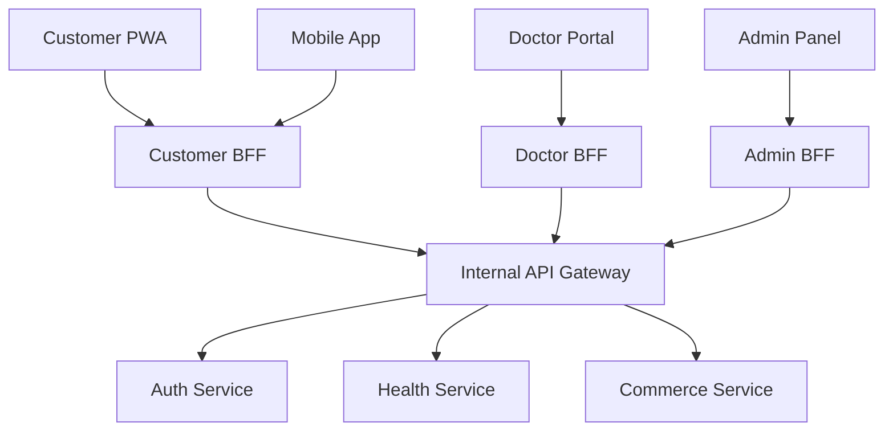

# API Architecture Map

> [!NOTE]
> This document outlines the API strategy, endpoints, and data contracts for the Medivo platform. It enforces a consistent, secure, and scalable API surface across all clients.

## API Architecture Overview

Medivo uses the **Backend-for-Frontend (BFF)** pattern. Instead of exposing a generic REST API to all clients, we expose tailored GraphQL or REST endpoints via BFF servers. These BFFs orchestrate calls to internal domain services (the Modular Monolith) via gRPC or fast local HTTP calls.



## API Conventions

All external-facing APIs must adhere to the following strict conventions:

- **Base Paths**: `/api/v1/[domain]/...`
- **Authentication**: JWT Bearer tokens passed in the `Authorization` header.
- **Standard Response Format**:
  All responses (success or failure) must wrap data in a standard envelope.
  ```json
  {
    "success": true,
    "data": { ... },
    "error": null,
    "meta": {
      "timestamp": "2024-01-01T12:00:00Z",
      "requestId": "req_123456"
    }
  }
  ```
- **Standard Error Format**:
  ```json
  {
    "success": false,
    "data": null,
    "error": {
      "code": "VALIDATION_ERROR",
      "message": "Invalid input parameters",
      "details": [{ "field": "email", "issue": "Invalid format" }]
    },
    "meta": { ... }
  }
  ```
- **Pagination**: Use Cursor-based pagination for large datasets to ensure stable pagination during real-time updates.
  ```json
  {
    "data": [...],
    "meta": {
      "nextCursor": "cXdlcnR5dWlvcA==",
      "hasNextPage": true
    }
  }
  ```
- **Versioning**: URL path versioning (e.g., `/v1/`). Major breaking changes require a `/v2/`.

## BFF Endpoints

### 1. Customer BFF (`customer-bff`)
Tailored for the PWA and Mobile app. Aggregates data to reduce network roundtrips.

- **Auth**: `/auth/login`, `/auth/register`, `/auth/refresh`, `/auth/oauth`
- **Profile**: `/profile/me`, `/profile/preferences`
- **Skin Intelligence**:
  - `POST /skin/analyze`: Upload image for AI analysis.
  - `GET /skin/history`: Retrieve past analyses.
  - `GET /skin/routine`: Get AI-generated daily routine.
- **Health Reports**: `/health/metrics`, `/reports/generate`, `/reports/{id}`
- **Appointments**: `/appointments/upcoming`, `/appointments/book`
- **Commerce**: `/products/recommended`, `/cart`, `/checkout`
- **Notifications**: `/notifications`, `/notifications/preferences`

### 2. Doctor BFF (`doctor-bff`)
Tailored for clinical workflows.

- **Auth**: `/auth/login` (MFA required)
- **Patients**: `/patients/assigned`, `/patients/{id}/history`
- **Appointments**: `/appointments/schedule`, `/appointments/manage`
- **Consultations**: `POST /consultations/{id}/notes`, `POST /consultations/{id}/prescriptions`
- **Analytics**: `/analytics/patient-outcomes`

### 3. Admin BFF (`admin-bff`)
Tailored for system management and operations.

- **Users**: `/users`, `/users/ban`, `/doctors/verify`
- **Commerce**: `/inventory`, `/orders/manage`
- **System**: `/system/health`, `/system/ai-metrics`

## Core Service Endpoints (Internal)

These endpoints are *not* exposed to the public internet. They are consumed exclusively by the BFFs and other internal services.

- **Auth Service**: `grpc://auth.internal:50051/VerifyToken`
- **AI Service**: `grpc://ai.internal:50051/ProcessSkinImage`, `grpc://ai.internal:50051/GenerateReport`
- **Commerce Service**: `grpc://commerce.internal:50051/ReserveInventory`
- **Appointment Service**: `grpc://appointments.internal:50051/CheckAvailability`
- **Notification Service**: `grpc://notifications.internal:50051/DispatchMessage`

## API Versioning Strategy

- **Non-breaking changes** (adding fields, adding optional parameters, adding new endpoints) do not require a version bump.
- **Breaking changes** (removing fields, changing types, changing response structures) require deploying a new version (e.g., `/v2/`).
- Deprecated versions are supported for 6 months before being decommissioned.

## API Security Rules

> [!CAUTION]
> Security is non-negotiable. All endpoints must adhere to these policies.

1. **Zero Trust**: Every endpoint must validate authentication and authorization independently.
2. **Input Validation**: All incoming payloads must be validated against Zod schemas in the BFF layer before reaching services.
3. **CORS**: Strict CORS policies allowing only approved origins (e.g., `https://app.medivo.health`).
4. **Data Masking**: PII and PHI (Protected Health Information) must be masked in logs.
5. **No Direct ID References**: Use obfuscated IDs (e.g., UUIDs or NanoIDs) instead of auto-incrementing database integers.

## Rate Limiting Strategy

Implemented at the API Gateway / BFF level using Redis.
- **Public endpoints (e.g., Login)**: 5 requests / minute / IP.
- **Authenticated endpoints**: 100 requests / minute / User ID.
- **Heavy operations (e.g., AI generation)**: 5 requests / hour / User ID.
