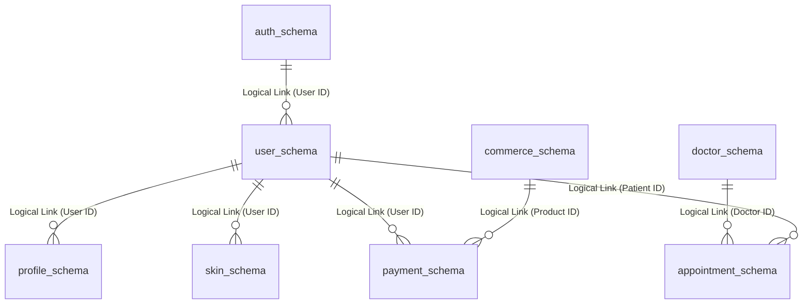

# Database Architecture Map

> [!NOTE]
> This document defines the comprehensive database strategy for the Medivo platform. We utilize a single PostgreSQL cluster utilizing a strict **Schema-per-Domain** architecture to ensure data isolation while maintaining operational simplicity. It dictates the rules of engagement for all database interactions.

## Database Strategy Overview

To support the Modular Monolith architecture, we deploy a single high-availability PostgreSQL instance. However, to prevent data coupling (the dreaded "Big Ball of Mud"), we enforce logical isolation using PostgreSQL schemas.

**The Golden Rule**: Services can only read/write to their assigned schema. Cross-schema JOINs are strictly prohibited at the database level. Data required from other domains must be fetched via the service layer (API) or replicated via asynchronous Domain Events.

## Complete Schema Inventory

Below is the exhaustive list of schemas, their owner services, and key tables with column descriptions.

### 1. `auth_schema` (Owner: Auth Service)
Handles identity, authentication, and Role-Based Access Control (RBAC).

| Table | Key Columns | Description |
| :--- | :--- | :--- |
| `users` | `id` (UUID, PK), `email` (Unique), `password_hash`, `status` (Enum), `created_at` | Core identity record. |
| `roles` | `id` (UUID, PK), `name` (String), `permissions` (JSONB) | Defined roles (Admin, Doctor, Patient). |
| `user_roles` | `user_id` (UUID, FK), `role_id` (UUID, FK) | Mapping users to roles. |
| `sessions` | `id` (UUID, PK), `user_id` (UUID, FK), `token_hash`, `expires_at`, `device_ip` | Active refresh token sessions. |

### 2. `user_schema` (Owner: Core API)
Handles general user settings and non-health metadata.

| Table | Key Columns | Description |
| :--- | :--- | :--- |
| `user_profiles` | `user_id` (UUID, PK), `first_name`, `last_name`, `avatar_url`, `timezone` | General profile data. |
| `user_preferences`| `user_id` (UUID, PK), `marketing_opt_in` (Bool), `theme` (Enum) | Application preferences. |

### 3. `profile_schema` (Owner: Health Service)
**HIGHLY SENSITIVE - PHI**. Contains medical profiles and history.

| Table | Key Columns | Description |
| :--- | :--- | :--- |
| `health_profiles` | `user_id` (UUID, PK), `date_of_birth`, `biological_sex`, `blood_type` | Core immutable health data. |
| `medical_history` | `id` (UUID, PK), `user_id` (UUID), `condition`, `diagnosed_date`, `notes` | Past medical conditions. |
| `allergies` | `id` (UUID, PK), `user_id` (UUID), `allergen`, `severity` (Enum), `reaction` | Known patient allergies. |

### 4. `skin_schema` (Owner: AI Service)
Contains skin imagery metadata and AI analysis results.

| Table | Key Columns | Description |
| :--- | :--- | :--- |
| `skin_analyses` | `id` (UUID, PK), `user_id` (UUID), `image_s3_key`, `overall_score`, `status` | Record of a single scan. |
| `skin_conditions` | `id` (UUID, PK), `analysis_id` (UUID, FK), `condition_type`, `severity_score`, `bounding_box` (JSONB)| Specific issues detected. |
| `skin_routines` | `id` (UUID, PK), `user_id` (UUID), `recommended_products` (JSONB), `schedule` | AI-generated daily routines. |

### 5. `ai_schema` (Owner: AI Service)
Generic AI model tracking and feedback loops.

| Table | Key Columns | Description |
| :--- | :--- | :--- |
| `ai_predictions` | `id` (UUID, PK), `model_version`, `input_hash`, `output_payload` (JSONB), `latency_ms`| Audit log of AI inferences. |
| `ai_feedback` | `id` (UUID, PK), `prediction_id` (UUID, FK), `user_rating`, `correction_notes` | Human-in-the-loop feedback. |

### 6. `report_schema` (Owner: Health Service)
Generated intelligence reports.

| Table | Key Columns | Description |
| :--- | :--- | :--- |
| `health_reports` | `id` (UUID, PK), `user_id` (UUID), `report_type`, `s3_pdf_key`, `generated_at` | Record of generated PDFs. |
| `report_templates`| `id` (UUID, PK), `name`, `html_template` (Text), `version` | Templates for generation. |

### 7. `health_schema` (Owner: Health Service)
Timeseries health data and goals.

| Table | Key Columns | Description |
| :--- | :--- | :--- |
| `health_metrics` | `id` (UUID, PK), `user_id` (UUID), `metric_type` (Enum), `value` (Float), `unit`, `recorded_at` | e.g., weight, steps, sleep hrs. |
| `health_goals` | `id` (UUID, PK), `user_id` (UUID), `metric_type`, `target_value`, `deadline_date` | User-set health targets. |

### 8. `doctor_schema` (Owner: Appointments Service)
Provider profiles and schedules.

| Table | Key Columns | Description |
| :--- | :--- | :--- |
| `doctors` | `id` (UUID, PK), `user_id` (UUID), `specialization`, `license_number`, `bio` | Doctor public profiles. |
| `availability` | `id` (UUID, PK), `doctor_id` (UUID, FK), `day_of_week`, `start_time`, `end_time` | Standard working hours. |

### 9. `appointment_schema` (Owner: Appointments Service)
Booking engine and consultation notes.

| Table | Key Columns | Description |
| :--- | :--- | :--- |
| `appointments` | `id` (UUID, PK), `patient_id` (UUID), `doctor_id` (UUID), `scheduled_time`, `status` | Core booking record. |
| `consultation_notes`| `id` (UUID, PK), `appointment_id` (UUID, FK), `clinical_notes` (Text), `prescriptions` | Post-appointment records. |

### 10. `commerce_schema` (Owner: Commerce Service)
Catalog and stock management.

| Table | Key Columns | Description |
| :--- | :--- | :--- |
| `products` | `id` (UUID, PK), `sku`, `name`, `description`, `price_cents`, `is_active` | Catalog items. |
| `inventory` | `product_id` (UUID, PK), `quantity_available`, `reserved_quantity`, `restock_date` | Stock levels. |

### 11. `payment_schema` (Owner: Commerce Service)
Transactions and subscriptions.

| Table | Key Columns | Description |
| :--- | :--- | :--- |
| `orders` | `id` (UUID, PK), `user_id` (UUID), `status` (Enum), `total_amount_cents`, `stripe_pi_id` | Core order record. |
| `order_items` | `id` (UUID, PK), `order_id` (UUID, FK), `product_id` (UUID), `quantity`, `price_at_purchase` | Line items. |
| `subscriptions` | `id` (UUID, PK), `user_id` (UUID), `plan_type`, `status`, `next_billing_date` | Recurring billing records. |

### 12. `notification_schema` (Owner: Notifications Service)
Message logs and user preferences.

| Table | Key Columns | Description |
| :--- | :--- | :--- |
| `notifications` | `id` (UUID, PK), `user_id` (UUID), `type` (Email/SMS), `status`, `sent_at` | Audit log of messages sent. |
| `notification_prefs`| `user_id` (UUID, PK), `email_enabled` (Bool), `sms_enabled` (Bool), `push_enabled` | Communication settings. |

### 13. `analytics_schema` (Owner: Core API)
Internal system metrics and user analytics.

| Table | Key Columns | Description |
| :--- | :--- | :--- |
| `events` | `id` (UUID, PK), `user_id` (UUID), `event_name`, `properties` (JSONB), `timestamp` | Product analytics events. |

## Cross-Schema Rules

> [!WARNING]
> Enforcing these rules is critical for the long-term viability of the Modular Monolith. Breaking these rules prevents future microservice extraction.

1. **NO Direct Cross-Schema Queries**: 
   - **Forbidden Example**: `SELECT o.id, u.email FROM payment_schema.orders o JOIN auth_schema.users u ON o.user_id = u.id;`
   - **Allowed Example**: The Commerce Service queries `payment_schema.orders`. It then makes an internal API call (or uses a gRPC client) to the Auth Service to retrieve the `UserDTO` containing the email.
2. **NO Cross-Schema Foreign Keys**:
   - `payment_schema.orders.user_id` is a UUID, but it does NOT have an SQL `FOREIGN KEY` constraint pointing to `auth_schema.users.id`. Referential integrity across domains is handled at the application layer.
3. **Database Roles**: 
   - We provision specific PostgreSQL roles (e.g., `role_commerce_svc`).
   - `role_commerce_svc` only has `GRANT SELECT, INSERT, UPDATE, DELETE ON ALL TABLES IN SCHEMA commerce_schema, payment_schema`. Attempting to query `auth_schema` results in a database error.

## Migration Strategy

- **Scoping**: Migrations are strictly scoped per domain and reside within the domain's package (e.g., `packages/ecommerce/prisma/migrations/`).
- **Tooling**: We utilize Prisma Migrate for declarative schema management and generating migration SQL scripts.
- **Naming Convention**: `YYYYMMDDHHMMSS_brief_description` (handled automatically by Prisma).
- **Forward Compatibility**: All migrations must be non-destructive.
  - To drop a column:
    1. Phase 1: Add new column, update code to write to both, read from old.
    2. Phase 2: Backfill data, update code to read from new.
    3. Phase 3: Stop writing to old column.
    4. Phase 4: Drop old column in a later release.
- **Rollback Procedures**: Down-migrations are discouraged. Instead, we "roll forward" by writing a new migration that reverts the changes of the problematic migration.

## Future Extraction Path

Because schemas are strictly isolated, extracting a domain (e.g., Commerce) to a microservice requires zero database refactoring. The step-by-step process:

1. **Provision Infrastructure**: Spin up a new PostgreSQL cluster dedicated to the new Commerce Microservice.
2. **Logical Replication**: Setup PostgreSQL Logical Replication to sync `commerce_schema` and `payment_schema` from the Monolith DB to the new Microservice DB.
3. **Deploy Microservice**: Deploy the new Commerce service pointing to the *Monolith DB* but reading from the *Microservice DB* (blue/green DB deployment).
4. **Cutover**: Stop the Commerce module in the Monolith. Promote the Microservice DB to primary (read/write). The API Gateway routes commerce traffic to the new service.
5. **Cleanup**: Drop `commerce_schema` and `payment_schema` from the Monolith DB.

## Data Retention Policies

- **PHI / Medical Data (`profile_schema`, `health_schema`, `skin_schema`)**: Retained indefinitely unless explicitly deleted by the user, per HIPAA/GDPR compliance requirements. Soft deletes are used; hard deletes are executed via a 30-day background cron job upon account deletion request.
- **System Logs / Analytics (`analytics_schema`)**: Rolled up weekly. Raw events dropped after 90 days.
- **Notification Logs (`notification_schema`)**: Dropped after 30 days.
- **Inactive Accounts**: Data is anonymized (PII stripped, UUIDs kept for analytical integrity) after 3 years of complete inactivity.

## Backup Strategy

- **Continuous**: Write-Ahead Logs (WAL) are archived continuously to AWS S3. Allows Point-in-Time Recovery (PITR) with RPO (Recovery Point Objective) < 5 minutes.
- **Daily**: Automated full database snapshots taken at 03:00 UTC. Retained for 30 days.
- **Weekly**: Encrypted backup copies are automatically replicated to a secondary geographic AWS region to provide disaster recovery capability in case of a complete region failure.
- **Testing**: Automated script restores the database from a snapshot to a staging environment weekly to verify backup integrity.

## Indexing Guidelines

- **Primary Keys**: Every table must have a UUID primary key.
- **Foreign Keys**: Every column acting as a logical foreign key (even within the same schema) must have a B-Tree index.
- **JSONB Fields**: Use GIN indexes for unstructured data that is frequently queried.
  - *Recommendation*: `CREATE INDEX idx_skin_conditions_bbox ON skin_schema.skin_conditions USING GIN (bounding_box);`
- **Timeseries Data**: Use BRIN (Block Range INdexes) for large timeseries tables.
  - *Recommendation*: `CREATE INDEX idx_health_metrics_recorded_at ON health_schema.health_metrics USING BRIN (recorded_at);`
- **Soft Deletes**: If using `deleted_at`, implement Partial Indexes to keep index size small.
  - *Recommendation*: `CREATE INDEX idx_users_active ON auth_schema.users (email) WHERE deleted_at IS NULL;`
- **Performance Tuning**: Avoid premature optimization. Rely on `pg_stat_statements` and slow query logs to identify missing indexes in production.
