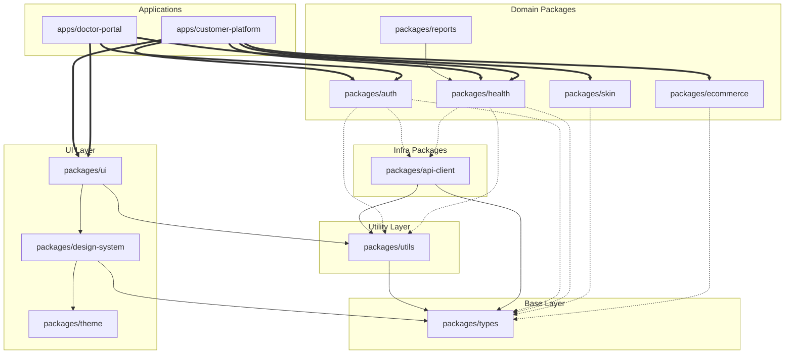

# Dependency Map

> [!NOTE]
> This document maps both internal monorepo dependencies and critical external third-party dependencies. Strict dependency management is essential for monorepo health, security, and build performance.

## Internal Dependencies Graph

The internal dependency structure enforces the architectural boundaries of the Medivo platform.

## External Dependencies

Careful selection of external libraries minimizes bloat and security vulnerabilities.

| Package | Version | Purpose | License | Risk Level |
| :--- | :--- | :--- | :--- | :--- |
| `next` | `14.x` | React Framework for Web/Admin apps | MIT | Low |
| `react-native` | `0.74.x` | Core mobile framework | MIT | Medium (Upgrade complexity) |
| `expo` | `51.x` | Mobile build & integration toolkit | MIT | Low |
| `typescript` | `5.x` | Type system | Apache-2.0| Low |
| `tailwindcss` | `3.4.x` | Utility-first CSS | MIT | Low |
| `zod` | `3.x` | Schema declaration and validation | MIT | Low |
| `pg` / `prisma` | `5.x` | DB driver and ORM/Query Builder | MIT | Medium (Data lock-in) |
| `bullmq` | `5.x` | Redis-based queue system | MIT | Low |
| `stripe` | `14.x` | Payments integration | MIT | Low |
| `openai` | `4.x` | AI Model API client | MIT | Medium (API changes) |

## Dependency Rules

> [!IMPORTANT]
> These rules are validated by CI. Any PR violating these rules will be automatically rejected.

1. **Directionality**: 
   - Applications depend on Packages.
   - Services depend on Packages.
   - Packages depend on other Packages (strictly downwards towards `types`).
   - **Never**: Packages depending on Apps or Services.
2. **Circular Dependencies**: Strictly forbidden. Enforced via `dpdm` or `dependency-cruiser`.
3. **Shared Contracts**: All cross-boundary communication payloads must be typed via interfaces in `packages/types`.

## Dependency Management Strategy

### Version Pinning Strategy
- All external dependencies in `package.json` must be pinned to a specific minor version (e.g., `"react": "~18.2.0"`).
- We use a unified `pnpm-workspace.yaml` to ensure single versions of core libraries (like React, TypeScript) across all workspaces to prevent bundle duplication and version conflicts.

### Update Policy
- **Security Patches**: Applied immediately via automated Dependabot/Renovate PRs.
- **Minor Updates**: Reviewed and merged bi-weekly.
- **Major Updates**: Planned as explicit engineering tasks, requiring an architecture review if it affects core frameworks (Next.js, React Native).

### Security Scanning
- Continuous scanning via GitHub Advanced Security and Snyk.
- Build fails if high/critical vulnerabilities are detected in production dependencies.

### License Compliance
- Only permissive licenses (MIT, Apache 2.0, BSD) are allowed by default.
- GPL/AGPL dependencies are strictly prohibited to prevent copyleft pollution of the proprietary codebase. Enforced via `license-checker` in the CI pipeline.

## Critical Dependencies

The following dependencies represent critical points of failure. Breaking changes here require extensive regression testing:
1. **Next.js App Router**: Drives the entirely of the web routing and server-rendering model.
2. **Expo SDK**: Upgrades often require coordinated updates to native modules and React Native core.
3. **Prisma / Database Client**: Changes to query generation can cause severe performance regressions.

## Dependency Health Dashboard

*(To be implemented via CI metrics)*
- Current Monorepo Size: *Pending*
- Outdated Dependencies: *Pending*
- Average Bundle Size (Customer Platform): *Target < 200kb gzipped (initial JS)*
