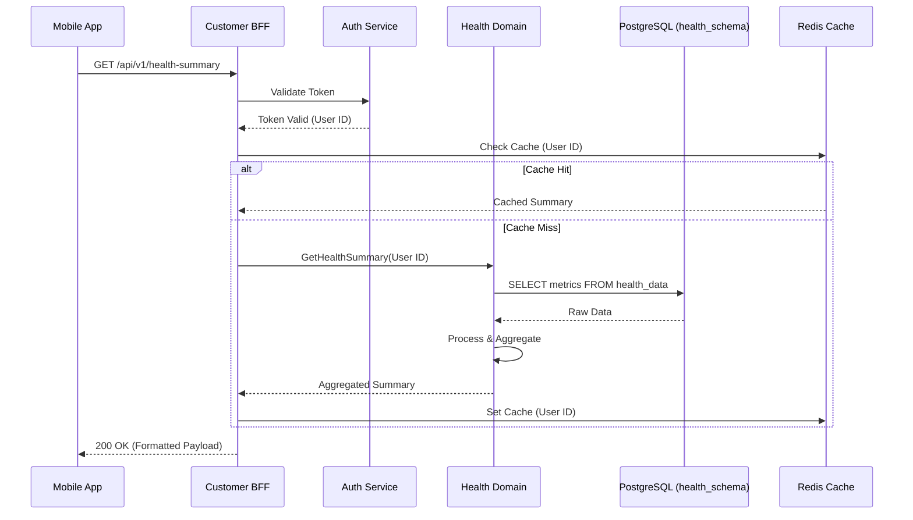
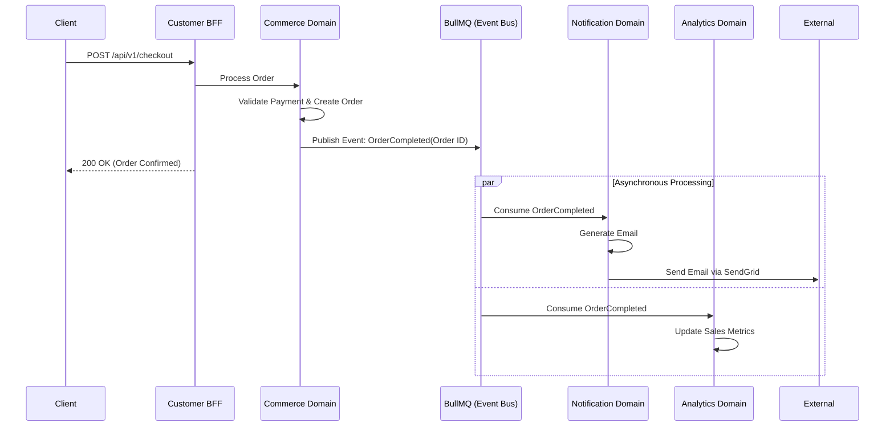

# System Map

> [!NOTE]
> This document provides the high-level system architecture of the Medivo Health Intelligence Platform, detailing the interaction between applications, BFFs, core services, and infrastructure.

## System Overview

Medivo employs a modern, multi-tier architecture utilizing the Backend-for-Frontend (BFF) pattern. This ensures that diverse clients (web, mobile, admin, doctors) receive optimized payloads and API interfaces tailored to their specific needs. The core business logic resides in a Modular Monolith, supported by robust asynchronous processing and domain-isolated data storage.

## System Architecture Diagram

```mermaid
C4Context
    title System Architecture - Medivo Health Intelligence Platform

    Person(customer, "Customer", "Uses the platform for health tracking and shopping")
    Person(doctor, "Doctor", "Provides consultations and reviews health data")
    Person(admin, "Admin", "Manages platform operations")

    System_Boundary(apps, "Application Layer") {
        System(marketing, "Marketing Web", "Public site (Next.js)")
        System(customer_app, "Customer Platform", "PWA (Next.js)")
        System(mobile_app, "Mobile App", "iOS/Android (React Native)")
        System(doctor_portal, "Doctor Portal", "Dashboard (Next.js)")
        System(admin_panel, "Admin Panel", "Dashboard (Next.js)")
    }

    System_Boundary(bff, "BFF Layer") {
        System(customer_bff, "Customer BFF", "Aggregates APIs for customers")
        System(doctor_bff, "Doctor BFF", "Aggregates APIs for doctors")
        System(admin_bff, "Admin BFF", "Aggregates APIs for admins")
    }

    System_Boundary(services, "Core Services (Modular Monolith)") {
        System(api_gateway, "Core API", "Routing and shared middleware")
        System(ai_svc, "AI Service", "AI processing & model interaction")
        System(auth_svc, "Auth Service", "Identity & Access Management")
        System(commerce_svc, "Commerce Service", "E-commerce & Payments")
        System(appointment_svc, "Appointment Service", "Scheduling & Consultations")
        System(notification_svc, "Notification Service", "Email/SMS/Push delivery")
    }

    System_Boundary(infra, "Infrastructure Layer") {
        SystemDb(postgres, "PostgreSQL", "Relational Database (Schema-per-domain)")
        SystemDb(redis, "Redis", "Cache, Sessions, Pub/Sub")
        SystemQueue(bullmq, "BullMQ", "Background Job Queue")
        SystemDb(s3, "AWS S3", "Object Storage")
    }

    System_Ext(payment_gw, "Payment Gateway", "Stripe/Braintree")
    System_Ext(ai_providers, "AI/ML Providers", "OpenAI, Anthropic, Custom Models")
    System_Ext(comms_gw, "Comms Providers", "Twilio, SendGrid")
    System_Ext(health_apis, "Health APIs", "HealthKit, Health Connect, Wearables")
    System_Ext(hospital_apis, "Hospital Integration", "External Healthcare Systems")

    Rel(customer, marketing, "Visits", "HTTPS")
    Rel(customer, customer_app, "Uses", "HTTPS")
    Rel(customer, mobile_app, "Uses", "HTTPS")
    Rel(doctor, doctor_portal, "Uses", "HTTPS")
    Rel(admin, admin_panel, "Uses", "HTTPS")

    Rel(customer_app, customer_bff, "API Calls", "GraphQL/REST")
    Rel(mobile_app, customer_bff, "API Calls", "GraphQL/REST")
    Rel(doctor_portal, doctor_bff, "API Calls", "GraphQL/REST")
    Rel(admin_panel, admin_bff, "API Calls", "GraphQL/REST")

    Rel(customer_bff, api_gateway, "Internal API Calls", "gRPC/REST")
    Rel(doctor_bff, api_gateway, "Internal API Calls", "gRPC/REST")
    Rel(admin_bff, api_gateway, "Internal API Calls", "gRPC/REST")

    Rel(api_gateway, ai_svc, "Routes to")
    Rel(api_gateway, auth_svc, "Routes to")
    Rel(api_gateway, commerce_svc, "Routes to")
    Rel(api_gateway, appointment_svc, "Routes to")
    Rel(api_gateway, notification_svc, "Routes to")

    Rel(services, postgres, "Reads/Writes (Isolated schemas)")
    Rel(services, redis, "Caches data")
    Rel(services, bullmq, "Enqueues/Dequeues Jobs")
    Rel(services, s3, "Stores/Retrieves files")

    Rel(commerce_svc, payment_gw, "Processes payments")
    Rel(ai_svc, ai_providers, "Invokes models")
    Rel(notification_svc, comms_gw, "Sends messages")
    Rel(api_gateway, health_apis, "Syncs health data")
    Rel(api_gateway, hospital_apis, "Enterprise integration")
```

## Application Layer

- **`marketing-web`**: The public-facing marketing website. Built with Next.js using Static Site Generation (SSG) for maximum SEO and performance.
- **`customer-platform`**: The primary web application for customers (PWA). Provides access to health tracking, AI reports, and the marketplace. Built with Next.js.
- **`mobile`**: The iOS and Android application built with React Native and Expo. Offers deep integration with device health APIs (HealthKit, Health Connect).
- **`doctor-portal`**: A specialized dashboard for dermatologists and health professionals to review patient data, manage appointments, and conduct consultations.
- **`admin-panel`**: Internal tool for Medivo staff to manage platform configurations, users, product inventory, and monitor system health.

## BFF (Backend-for-Frontend) Layer

The BFF layer acts as an API gateway tailored to specific clients. It aggregates data from multiple core services, trims unnecessary fields, and handles client-specific authentication and caching.

- **`customer-bff`**: Serves `customer-platform` and `mobile`.
- **`doctor-bff`**: Serves `doctor-portal`.
- **`admin-bff`**: Serves `admin-panel`.

## Core Service Layer (Modular Monolith)

These logical services run within a single Node.js process initially but maintain strict internal boundaries.

- **`api`**: The core router and entry point for internal service communication.
- **`ai`**: Manages all AI interactions, orchestration, and prompt engineering.
- **`auth`**: Handles identity, token issuance, OAuth, and RBAC.
- **`commerce`**: Manages products, carts, checkout, and subscriptions.
- **`appointments`**: Handles scheduling, availability, and consultation lifecycle.
- **`notifications`**: Centralized service for dispatching emails, SMS, and push notifications based on templates and preferences.

## Infrastructure

- **PostgreSQL**: Single database instance utilizing schema-based multitenancy (schema-per-domain) to ensure data isolation.
- **Redis**: Used for high-speed caching, distributed rate limiting, and session storage.
- **BullMQ**: Handles asynchronous tasks (e.g., generating AI reports, processing payments, sending bulk emails).
- **AWS S3**: Secure object storage for user avatars, uploaded skin images, generated PDF reports, and product assets.

## External Integrations

- **Payment Gateways**: Stripe for payments and subscriptions.
- **AI/ML Providers**: OpenAI/Anthropic for LLM capabilities, plus proprietary models for specific image recognition tasks.
- **Comms Providers**: Twilio (SMS), SendGrid (Email).
- **Health APIs**: Apple HealthKit, Google Health Connect, and direct wearable API integrations (e.g., Oura, Whoop).
- **Hospital Integration**: Standardized REST/FHIR APIs and WebViews for enterprise B2B hospital deployments.

## Data Flow Diagram



## Event Flow Diagram


