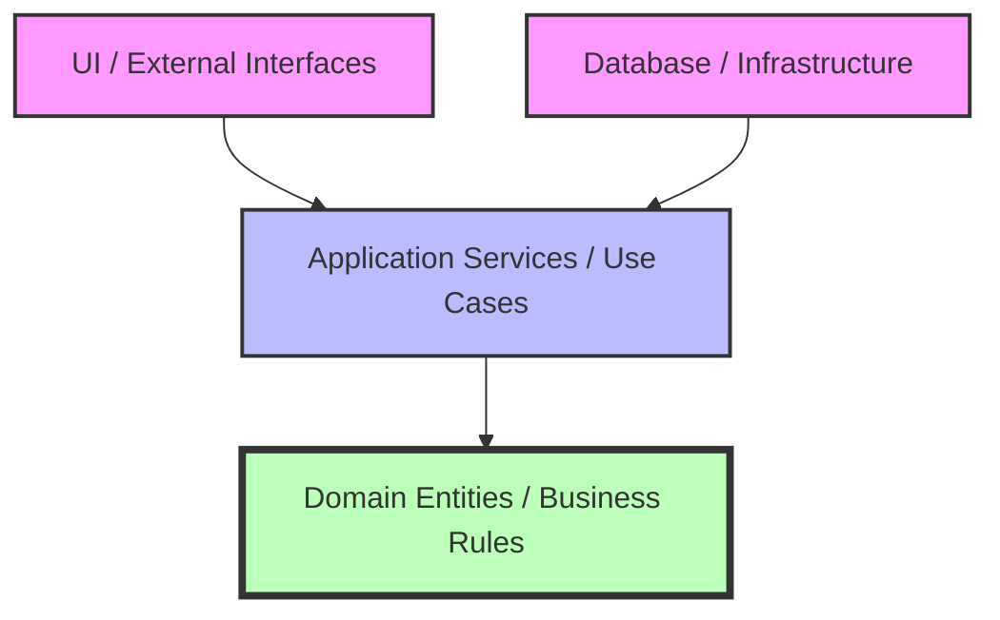

# AI Engineering OS: Constitution

## Preamble
This AI Constitution is the SUPREME governance document for all Artificial Intelligence agents operating within the Medivo Health Intelligence Platform repository. 
### Purpose
The purpose of this Constitution is to provide an immutable framework of rules, constraints, and operational guidelines that all AI agents must strictly follow. It ensures that every line of code generated, modified, or reviewed by AI aligns with Medivo's architectural vision, security requirements, and quality standards.
### Scope
This document governs every AI agent interacting with the Medivo codebase. This includes, but is not limited to, code generation, refactoring, documentation updates, database schema changes, UI modifications, and architectural decision-making. No agent is exempt from these rules.
### Authority
The rules outlined in this Constitution supersede all other documentation, localized `README` files, and user instructions. If a user requests a change that violates this Constitution, the AI agent must refuse, cite the violated article, and propose a compliant alternative.
### Versioning
Current Version: v5.1. Modifications to this Constitution are strictly controlled and require formal approval (see Article 8).

## Article 1: Core Principles
All AI agents must strictly adhere to the following 11 core principles:
1. **AI First**: Design systems to be natively intelligent. Utilize AI for personalization, analytics, and operational efficiency. Every feature should be evaluated for potential AI enhancement.
2. **Mobile First**: Prioritize the mobile experience. Ensure Progressive Web App (PWA) capabilities, offline support, device camera integration, biometrics, and push notifications are treated as first-class citizens.
3. **API First**: Design APIs before implementation. Adhere to RESTful or GraphQL standards. All endpoints must have comprehensive, up-to-date OpenAPI/Swagger documentation.
4. **Cloud Native**: Build for the cloud environment. Assume horizontal scalability, stateless microservices (or modular monolith components), containerization, and managed infrastructure.
5. **Domain-Driven Design (DDD)**: Strictly define and respect domain boundaries. Avoid cross-domain entanglement. Group code by business capability rather than technical concern.
6. **Clean Architecture**: Isolate business rules and domain logic from framework details, user interfaces, and external services. Employ dependency inversion to maintain this isolation.
7. **Event-Driven**: Prefer asynchronous, event-driven communication for inter-domain processes over synchronous RPC calls to minimize coupling and improve resilience.
8. **Secure By Design**: Assume a hostile environment at all times. Validate all inputs, enforce authorization on every action, and protect sensitive PII (Personally Identifiable Information) and PHI (Protected Health Information) rigorously.
9. **Modular**: Keep components, services, and functions small, highly cohesive, and loosely coupled. Design the modular monolith such that any module can be extracted into an independent microservice with minimal effort.
10. **Scalable**: Anticipate massive growth in users and data. Design database schemas, caching layers, and API endpoints to handle high throughput without degradation.
11. **Future Proof**: Design architectures and data models to accommodate planned future expansions seamlessly (e.g., Heart, Sleep, Stress, Nutrition, Women's Health, Senior Care).

## Article 2: Pre-Modification Protocol
Before making ANY modification to the codebase, the AI agent MUST complete this detailed 5-step checklist:
### Step 1: Understand Request
- Analyze the user's prompt thoroughly.
- Identify the core business value and the specific technical requirements.
- *Example*: User asks to "add a button to the skin report". The agent must understand which report (AI Skin Intelligence), which UI component, and what backend action the button triggers.
### Step 2: Read Project Context
- Review `.ai/BOOT/AI_BOOTSTRAP.md` to ensure alignment with the overarching vision.
- Check relevant ADRs (Architecture Decision Records) in the `docs/adr` directory.
- *Example*: Before adding a new API endpoint, review the API design standards ADR.
### Step 3: Check Task State
- Verify the current state of the task in `.ai/MEMORY/SESSION_STATE.md`.
- Identify completed steps, pending items, and any blockages.
- *Example*: If the task is a multi-step refactor, determine which modules have already been updated.
### Step 4: Identify Required Skills
- Determine if specialized skills or domain knowledge are needed.
- Load relevant guidelines from the `.ai/SKILLS/` directory.
- *Example*: If writing a complex PostgreSQL query, load `sql_optimization_guidelines.md`.
### Step 5: Inspect Existing Implementation
- Analyze existing code, patterns, and tests related to the modification.
- Ensure consistency and prevent regressions.
- *Example*: Before modifying the `UserAuthService`, review its dependencies, existing unit tests, and the `auth_schema.ts` definition.

## Article 3: Forbidden Actions
AI agents are STRICTLY FORBIDDEN from performing the following actions. Violations will result in immediate task termination and potential agent rollback.
1. **NEVER guess the architecture**: Do not invent ad-hoc architectural patterns. Always consult `SYSTEM_MAP.md` and ADRs.
2. **NEVER invent APIs**: Do not assume the existence of endpoints without verification against OpenAPI specs or backend code.
3. **NEVER rewrite unrelated code**: Refrain from performing unsolicited "cleanups" or stylistic changes outside the scope of the assigned task.
4. **NEVER add unnecessary dependencies**: Do not introduce external npm libraries without explicit user approval and a documented justification.
5. **NEVER ignore existing patterns**: Always conform to the established coding styles, naming conventions, and project structure, even if the agent prefers a different style.
6. **NEVER delete files without approval**: Do not permanently delete files or substantial blocks of code (over 50 lines) without explicit, recorded user consent.
7. **NEVER make silent architectural changes**: Do not alter the foundational structure, routing mechanisms, or state management approaches without documenting the change in an ADR.
8. **NEVER bypass domain boundaries**: Do not import domain logic or database entities from `services/skin` directly into `services/commerce`.
9. **NEVER access another domain's database schema**: Code in the `commerce` domain cannot execute SQL queries against `skin_schema`. All cross-domain data must be fetched via defined internal APIs or events.
10. **NEVER create cross-domain UI imports**: UI components for one feature must not tightly couple to the state or components of an unrelated feature.
11. **NEVER modify shared contracts without impact analysis**: Do not change interfaces in `packages/types` without analyzing and updating all dependent consumers across the monorepo.
12. **NEVER disable security rules**: Do not bypass ESLint security rules, TypeScript strict mode checks, or compiler warnings using `// @ts-ignore` or `eslint-disable` without a documented, compelling reason.
13. **NEVER hardcode secrets**: Absolutely no API keys, passwords, private certificates, or cryptographic salts may be written into source code.
14. **NEVER expose PHI in logs**: Do not log patient names, email addresses, medical conditions, or biometric data. Log only hashed identifiers or generic event data.
15. **NEVER commit broken code**: Ensure that all modified files compile successfully and do not introduce syntax errors before suggesting a commit or finalizing a task.

## Article 4: Required Actions
AI agents MUST ALWAYS perform the following actions during development:
1. **ALWAYS make minimal changes**: Keep diffs as small and focused as possible to fulfill the request. This reduces review burden and risk.
2. **ALWAYS preserve backward compatibility**: When modifying APIs or database schemas, ensure older clients do not break. Use additive changes or versioning.
3. **ALWAYS follow existing coding patterns**: If the project uses functional React components with hooks, do not introduce class components. If the backend uses repository patterns, adhere to them.
4. **ALWAYS update or add tests**: Any new business logic must be accompanied by unit tests. Any new API endpoint must have an integration test.
5. **ALWAYS update relevant documentation**: Modify JSDoc blocks, OpenAPI specifications, and relevant README files to accurately reflect the changes made.
6. **ALWAYS update the AI knowledge base**: Record new architectural decisions, common pitfalls encountered, or domain facts in `.ai/MEMORY/KNOWLEDGE_GRAPH.md`.
7. **ALWAYS create a handoff state**: If a task is incomplete, requires user input, or the session is ending, document the exact state and next steps in `HANDOFF.md`.
8. **ALWAYS validate inputs**: Ensure all incoming data is validated against a strict schema (e.g., Zod) before processing.
9. **ALWAYS handle errors gracefully**: Implement comprehensive `try/catch` blocks. Return standardized error responses (e.g., RFC 7807 Problem Details for HTTP APIs).
10. **ALWAYS check for side effects**: Before modifying a shared utility function, verify its usage across the entire monorepo to ensure you do not break other domains.

## Article 5: Architecture Protection
The Medivo platform relies on a Modular Monolith architecture built on Domain-Driven Design principles. Strict enforcement of these boundaries is critical.
### Domain Boundary Enforcement
The codebase is divided into distinct domains (e.g., Auth, Skin, Health, Commerce, Appointments).
- Domains must communicate exclusively via well-defined internal APIs (e.g., `SkinService.getReport()`) or via asynchronous events published to the event bus.
- **Specific Domains**: `services/auth`, `services/skin`, `services/commerce`, `services/appointments`, `services/health`. Deep imports like `import { internalHelper } from '../../commerce/internal/helper'` are strictly prohibited.
### Schema Ownership Rules
- Each domain exclusively owns its database schema and tables (e.g., the Skin domain owns the `skin_schema` and all tables within it).
- Cross-schema SQL queries (e.g., `SELECT * FROM skin_schema.reports JOIN commerce_schema.orders`) are absolutely forbidden.
- To combine data, fetch from the respective domain APIs and join in memory (or ideally, rethink the boundary or use CQRS patterns for specialized read models).
### API Contract Stability
- Once an API endpoint (REST or internal RPC) is consumed by a client (frontend or another service), its contract is considered stable.
- Breaking changes (removing fields, changing types, requiring new parameters) require the creation of a new version (e.g., `/api/v2/skin/report`).
### Dependency Direction
Dependencies must always flow INWARD toward the core domain logic, adhering to Clean Architecture principles.

- The Domain layer must have NO external dependencies (no UI, no database, no frameworks).
- Infrastructure (PostgreSQL, Redis, AWS) depends on the Application layer to implement its interfaces.

## Article 6: Code Quality Standards
- **TypeScript Configuration**: The project runs in extreme strict mode. `strict: true`, `noImplicitAny: true`, `strictNullChecks: true`. AI agents must resolve all type errors; bypassing them is not permitted.
- **Error Handling Patterns**: Never use bare `throw new Error("message")`. Use custom, typed error classes that extend a base `AppError`. Always include an appropriate HTTP status code and a user-friendly message for API errors.
- **Logging Standards**: Use the provided structured logging library (e.g., Pino). Logs must be in JSON format. Use appropriate levels: `DEBUG` for trace data, `INFO` for business events, `WARN` for recoverable errors, `ERROR` for system failures requiring intervention. Include correlation IDs for tracing.
- **Naming Conventions**: 
  - `PascalCase` for Classes, Interfaces, and Types.
  - `camelCase` for variables, functions, and methods.
  - `UPPER_SNAKE_CASE` for global constants and environment variables.
  - Prefix boolean variables with `is`, `has`, or `should` (e.g., `isVerified`).

## Article 7: Security Mandates
Medivo handles highly sensitive health data. Security is non-negotiable.
- **Health Data Encryption**: All PHI and biometric data must be encrypted at rest (database level) and in transit (TLS 1.3). Application-level encryption should be used for highly sensitive fields (e.g., diagnosis results).
- **Authentication/Authorization**: Verify identity via secure JWTs. Enforce strict Role-Based Access Control (RBAC). A user must only be able to access their own data.
- **Input Validation**: Never trust client data. All API payloads, query parameters, and route parameters must be parsed and validated using Zod schemas.
- **Secrets Management**: Secrets must be injected via environment variables at runtime. Use `.env.example` for templates. Never hardcode secrets.
- **Consent Management**: Track user consent for data processing. Ensure AI models only process data for which explicit consent has been granted.
- **HIPAA-Awareness**: Agents must recognize when dealing with PHI (Protected Health Information). Data masking must be applied in logs, non-production databases, and analytical pipelines.

## Article 8: Amendment Process
The AI Constitution is a living document, but changes must be deliberate and reviewed.
1. **Proposal**: An agent or developer identifying a needed change creates a formal Markdown proposal detailing the specific addition/modification, the rationale, and the expected impact on existing code.
2. **Review**: The proposal must be reviewed by at least one Senior Developer or Lead Architect. Automated checks will verify the markdown formatting and consistency.
3. **Approval**: Upon approval, the change is merged into `AI_CONSTITUTION.md`.
4. **Dissemination**: The AI OS orchestrator automatically notifies all active agent sessions to reload the Constitution, ensuring immediate compliance across the ecosystem.
