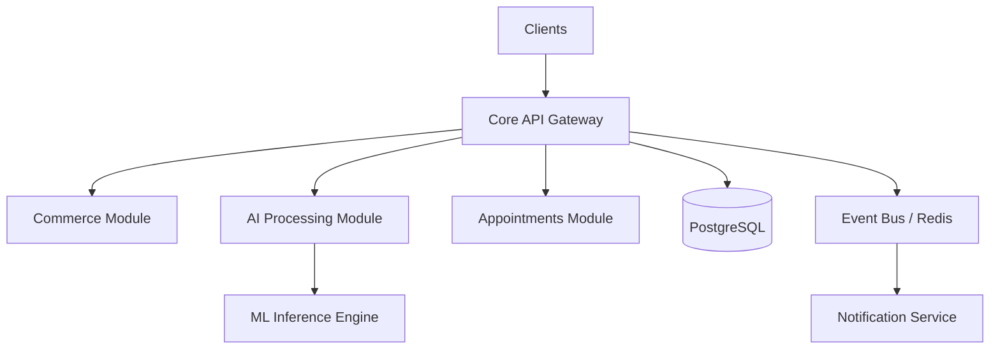

# 🏥 Medivo Health Intelligence Platform


## Project Vision
The Medivo Health Intelligence Platform is a premium, AI-powered digital health ecosystem designed to revolutionize the intersection of artificial intelligence and dermatology. Our mission is to provide an end-to-end, personalized health experience focusing on skin analysis, comprehensive health reporting, tailored routines, and direct access to top-tier dermatologists. By leveraging state-of-the-art AI models, Medivo offers highly accurate diagnostic support tools, enabling proactive health management and fostering stronger doctor-patient relationships within a secure, compliant environment.

## Architecture Overview
The platform employs a **Modular Monolith** architecture based on Domain-Driven Design (DDD) and Clean Architecture principles, ensuring clear boundaries between business domains while simplifying deployment. An Event-Driven approach is used for asynchronous workflows.



## Monorepo Structure
We use Turborepo and PNPM workspaces to manage this expansive ecosystem efficiently.

```text
medivo-health-intelligence/
├── apps/                        # End-user facing applications
│   ├── admin-bff/               # Node.js BFF for Admin Panel
│   ├── admin-panel/             # Next.js Internal Admin Dashboard
│   ├── customer-bff/            # Node.js BFF for Customer PWA & Mobile
│   ├── customer-platform/       # Next.js Customer Progressive Web App
│   ├── doctor-bff/              # Node.js BFF for Doctor Portal
│   ├── doctor-portal/           # Next.js Dermatologist Dashboard
│   ├── marketing-web/           # Next.js Public Marketing Website
│   └── mobile/                  # React Native Native Mobile App
├── packages/                    # Shared libraries and domain logic
│   ├── ai/                      # AI utilities and interfaces
│   ├── analytics/               # Analytics and telemetry
│   ├── api-client/              # Type-safe HTTP clients
│   ├── appointments/            # Appointment domain models
│   ├── auth/                    # Authentication utilities
│   ├── charts/                  # Recharts visualization components
│   ├── checkout/                # Checkout flow logic
│   ├── design-system/           # Tailwind-based Design System
│   ├── doctor/                  # Doctor domain logic
│   ├── ecommerce/               # Cart and pricing utilities
│   ├── forms/                   # React Hook Form & Zod helpers
│   ├── health/                  # Health metrics domain
│   ├── icons/                   # Lucide SVG icon library
│   ├── notifications/           # Notification types and helpers
│   ├── orders/                  # Order management models
│   ├── products/                # Product domain package
│   ├── profile/                 # User profile models
│   ├── reports/                 # Report generation templates
│   ├── skin/                    # Skin intelligence domain
│   ├── subscriptions/           # Subscription billing cycles
│   ├── theme/                   # Tailwind configuration
│   ├── types/                   # Root shared TypeScript types
│   ├── ui/                      # Business-agnostic React components
│   └── utils/                   # General utility functions
├── services/                    # Backend microservices/modules
│   ├── ai/                      # Inference and analysis worker
│   ├── api/                     # Core API Node.js server
│   ├── appointments/            # Scheduling engine
│   ├── auth/                    # Auth and session management
│   ├── commerce/                # Transaction processing
│   └── notifications/           # Dispatching emails, SMS, push
├── tooling/                     # Repository configurations
│   ├── eslint/                  # Shared ESLint rules
│   ├── prettier/                # Shared Prettier rules
│   ├── tailwind/                # Shared Tailwind presets
│   └── typescript/              # Shared TS configs
└── docs/                        # Project documentation
    ├── adr/                     # Architecture Decision Records
    ├── api/                     # OpenAPI/Swagger specs
    ├── architecture/            # System design docs
    ├── design-system/           # Storybook / UI catalog
    └── product/                 # PRDs and business logic
```

## Technology Stack

| Category | Technology | Version | Purpose |
| :--- | :--- | :--- | :--- |
| **Frontend Framework** | Next.js | 14.x | React framework for web apps (SSR, SSG, CSR) |
| **Mobile Framework** | React Native | 0.74+ | Cross-platform native application framework |
| **Styling** | TailwindCSS | 3.4+ | Utility-first CSS for the design system |
| **UI Components** | shadcn/ui | latest | Reusable, unstyled React components |
| **Backend Runtime** | Node.js | >=20.x | High-performance API runtime environment |
| **Language** | TypeScript | 5.x | End-to-end type safety |
| **Database** | PostgreSQL | 16.x | Primary relational datastore (schema-per-domain) |
| **Caching/Events** | Redis | 7.x | Caching, session store, and pub/sub |
| **Message Queue** | BullMQ | latest | Robust background job processing |
| **Storage** | AWS S3 | latest | Object storage for media and generated reports |
| **Monorepo Tooling** | Turborepo | 2.x | High-performance build system |
| **Package Manager** | pnpm | >=9.x | Fast, disk-space efficient package manager |

## Getting Started

### Prerequisites
Before you begin, ensure you have the following installed on your machine:
- **Node.js**: Version 20.0.0 or higher.
- **pnpm**: Version 9.0.0 or higher (`npm install -g pnpm`).
- **Docker**: For running local databases and Redis.

### Installation
1. Clone the repository:
   ```bash
   git clone https://github.com/medivo/medivo-health-intelligence.git
   cd medivo-health-intelligence
   ```
2. Install all dependencies across the monorepo:
   ```bash
   pnpm install
   ```
3. Set up environment variables:
   ```bash
   cp .env.example .env
   # Update the .env file with your local credentials
   ```

### Local Environment Setup
Start the required local infrastructure (PostgreSQL, Redis) using Docker Compose:
```bash
docker-compose up -d
```
Run database migrations:
```bash
pnpm run db:migrate
```

## Development Workflow
We use Turborepo to efficiently run tasks across all apps and packages.

### Common Commands
- **Start Development Servers**: Starts all apps in watch mode.
  ```bash
  pnpm dev
  ```
- **Build All Projects**: Compiles Next.js apps, builds TS packages.
  ```bash
  pnpm build
  ```
- **Run Tests**: Executes Jest/Vitest test suites across the monorepo.
  ```bash
  pnpm test
  ```
- **Run Linting**: Checks code quality with ESLint.
  ```bash
  pnpm lint
  ```
- **Format Code**: Formats codebase using Prettier.
  ```bash
  pnpm format
  ```
- **Clean Cache**: Removes Turborepo and Next.js caches.
  ```bash
  pnpm clean
  ```

## Project Conventions
- **Naming**: Use `kebab-case` for directory and file names. React components should be `PascalCase.tsx`.
- **File Structure**: Each module should expose its public API via `index.ts`. Do not use deep imports across package boundaries.
- **Commit Messages**: Follow the [Conventional Commits](https://www.conventionalcommits.org/) specification (e.g., `feat(api): add new skin analysis endpoint`).

## AI Engineering OS
This repository is optimized for autonomous AI agent collaboration.
- The `.ai/` directory contains configuration, prompts, and context files for AI agents.
- Agents utilize the strict types in `packages/types` and the explicit architecture boundaries to generate reliable code.
- To invoke the AI assistant for architectural generation, use the configured prompt scripts.

## Contributing
Please read through our [Contributing Guidelines](docs/CONTRIBUTING.md) to understand our development process, how to propose bug fixes and improvements, and how to build and test your changes.

## License
Copyright © 2026 Medivo Health Inc. All rights reserved.
Proprietary and Confidential. Not for external distribution.