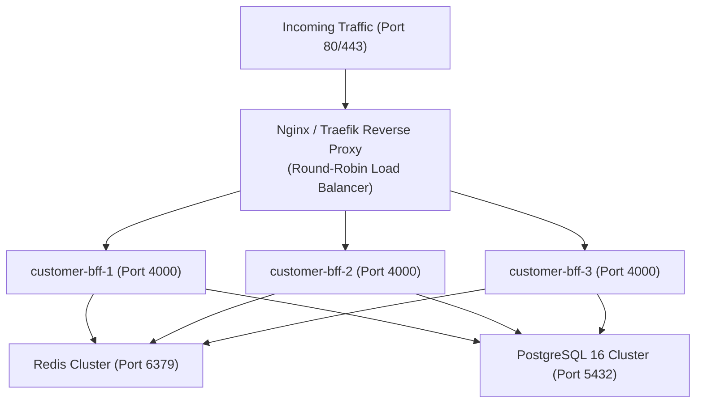

# Medivo Health Intelligence Platform — Scalability & Auto-Scaling Architecture

> **AI Engineering Operating System v5.1** — High-Load Elastic Auto-Scaling Strategy

---

## 1. Executive Summary: Does the System Auto-Scale?

| Environment | Scaling Capability | Mechanism | Current Status |
| :--- | :--- | :--- | :--- |
| **Local Docker Compose** | Manual / Static Replicas | `docker compose up -d --scale customer-bff=3` | Configured |
| **Production Kubernetes (EKS/GKE)** | **Automatic Dynamic Scaling** | Horizontal Pod Autoscaler (HPA) | **Fully Supported (Stateless Design)** |
| **AWS ECS / Fargate** | **Automatic Dynamic Scaling** | AWS Target Tracking Scaling Policies | **Fully Supported** |

> [!IMPORTANT]
> **Why Medivo Applications Are 100% Ready for Auto-Scaling**:
> All Medivo web applications (`customer-app`, `marketing-web`, `doctor-portal`, `admin-panel`) and API services (`customer-bff`) are **100% Stateless Twelve-Factor Apps**. Session states are signed with JWTs, and shared data is stored in Redis / PostgreSQL. This means any incoming HTTP request can be served by **any container replica** without session stickiness issues.

---

## 2. Docker Compose Local Scaling (Manual Multi-Container Replicas)

While `docker-compose` on a single developer machine does not run continuous auto-scaling metrics daemons by default, you can instantly scale any service up to **N container replicas** behind a load balancer:

### Scale Command:
```bash
docker compose up -d --scale customer-bff=3 --scale doctor-portal=2
```

### Docker Compose Scaling & Load Balancer Topology:



---

## 3. Production Cloud Auto-Scaling (Kubernetes HPA Manifests)

In production deployments (AWS EKS, GCP GKE, Azure AKS), the system utilizes Kubernetes **Horizontal Pod Autoscaling (HPA)** to scale containers dynamically based on real-time traffic and CPU/Memory utilization.

### Sample Kubernetes HPA Configuration (`k8s/hpa-customer-bff.yaml`):

```yaml
apiVersion: autoscaling/v2
kind: HorizontalPodAutoscaler
metadata:
  name: customer-bff-hpa
  namespace: medivo-prod
spec:
  scaleTargetRef:
    apiVersion: apps/v1
    kind: Deployment
    name: customer-bff-deployment
  minReplicas: 3
  maxReplicas: 50
  metrics:
    # 1. Scale up if CPU utilization exceeds 70%
    - type: Resource
      resource:
        name: cpu
        target:
          type: Utilization
          averageUtilization: 70
    # 2. Scale up if Memory utilization exceeds 80%
    - type: Resource
      resource:
        name: memory
        target:
          type: Utilization
          averageUtilization: 80
    # 3. Scale up if HTTP Request Rate exceeds 1000 req/sec
    - type: Pods
      pods:
        metric:
          name: http_requests_per_second
        target:
          type: AverageValue
          averageValue: 1000m
  behavior:
    scaleUp:
      stabilizationWindowSeconds: 0
      policies:
        - type: Percent
          value: 100
          periodSeconds: 15
    scaleDown:
      stabilizationWindowSeconds: 300
```

---

## 4. Bottleneck Prevention & Async Queue Offloading

To ensure high traffic spikes do not overload database pools or main thread execution:

1. **Async AI Vision Processing (BullMQ + Redis)**:
   - Heavy sub-dermal facial scan processing requests are offloaded to **BullMQ worker queues**.
   - API containers return an instant HTTP 202 Accepted status while background worker containers process PyTorch / ONNX model inference asynchronously.

2. **PgBouncer Database Connection Pooling**:
   - Manages up to **10,000+ concurrent client connections** using lightweight connection pooling in front of PostgreSQL 16.

3. **PostgreSQL Read Replicas**:
   - Heavy analytical read queries (e.g. Admin Console HIPAA audit streams) are routed to **Read Replicas**, keeping the primary master database 100% dedicated to fast write transactions.
